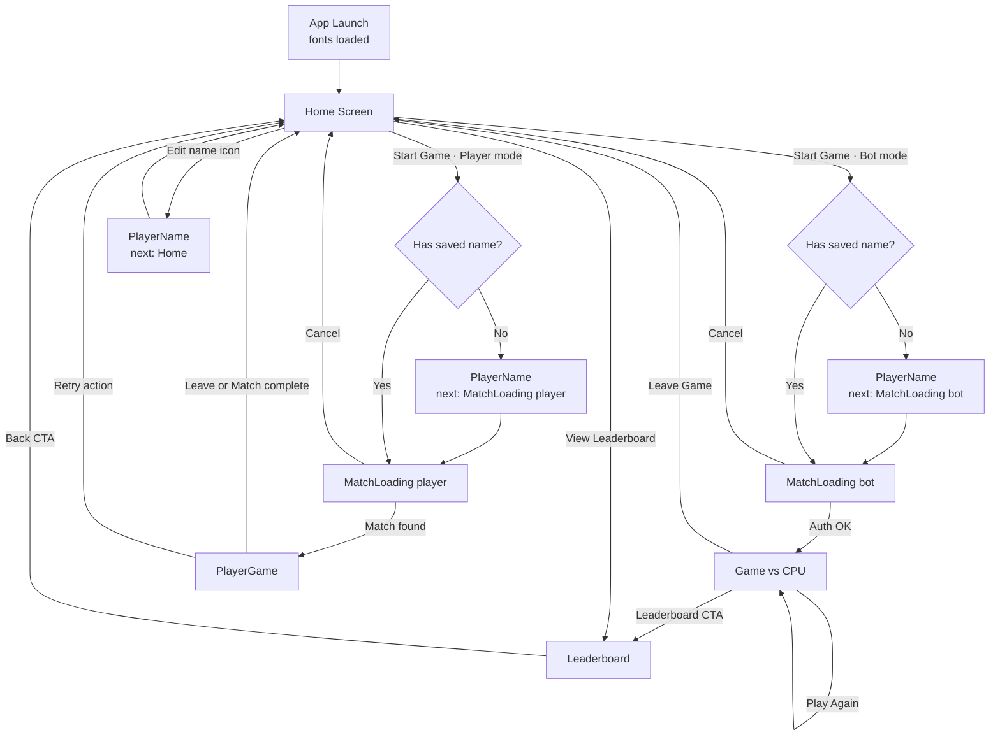

# Frontend Agent Guide

## Scope

These conventions apply to all files within the `frontend/` directory. Follow them when modifying existing code or adding new modules.

## Project Overview

The Expo React Native client renders the multiplayer Tic-Tac-Toe experience. Screens should follow the design system defined in `src/styles` and remain compatible with iOS, Android, and web builds. The app now integrates with Nakama server for authentication and user management.

## Navigation Overview



## Screen Reference Cheat Sheet

\*\*HomeScreen.tsx (`frontend/src/components/home/HomeScreen/HomeScreen.tsx`)

- Purpose: Landing lobby to choose bot or multiplayer with game mode selection (Classic/Blitz), surface greeting, and link to leaderboard.
- Routes: Starts PlayerName when no name or editing, otherwise pushes MatchLoading with the selected mode, and opens Leaderboard via CTA (`frontend/src/components/home/HomeScreen/HomeScreen.tsx:31`, `:64`).
- Components: `BackgroundGlow`, `GameIcons`, `GameModeSelector`, `CustomButton`, `IconButton`, `TextButton` (`frontend/src/components/home/HomeScreen/HomeScreen.tsx:16-20`).
- Game Mode Selection: Uses centralized `GameMode` type and `MatchmakingContext` for state management. `GameModeSelector` component provides Classic/Blitz toggle with consistent styling.
- Shared state/services: Reads `playerName` from `usePlayer`, game mode from `useMatchmaking`, and `ensureAuthenticated`/`isAuthLoading` from `useAuthCheck` before navigation (`frontend/src/components/home/HomeScreen/HomeScreen.tsx:24-43`).
- Caveats: Always await `ensureAuthenticated` so MatchLoading receives a valid session; keep the trimmed-name guard to avoid empty identifiers when users enter only whitespace; game mode state persists across navigation.

\*\*PlayerNameScreen.tsx (`frontend/src/components/onboarding/PlayerNameScreen/PlayerNameScreen.tsx`)

- Purpose: Collect or update the player display name and trigger authentication when needed.
- Routes: Uses `nextScreen` to return to Home, resume MatchLoading, or jump into PlayerGame after updates (`frontend/src/components/onboarding/PlayerNameScreen/PlayerNameScreen.tsx:58-78`).
- Components: `BackButton`, `CustomButton`, `BackgroundGlow`, `TextInput` shell for the name form (`frontend/src/components/onboarding/PlayerNameScreen/PlayerNameScreen.tsx:14-16`, `:103-127`).
- Shared state/services: Pulls setters and auth helpers from `usePlayer`, switching between `updatePlayerName`, `authenticate`, and local state sync (`frontend/src/components/onboarding/PlayerNameScreen/PlayerNameScreen.tsx:21-53`).
- Caveats: Preserve the optimistic navigation even on auth failure because follow-up screens re-check; ensure new flows pass `mode` when targeting MatchLoading so multiplayer paths pick the right provider.

\*\*MatchLoadingScreen.tsx (`frontend/src/components/onboarding/MatchLoadingScreen/MatchLoadingScreen.tsx`)

- Purpose: Bridge between lobby and gameplay, either spinning up a bot match or waiting for multiplayer matchmaking to complete.
- Routes: Bot mode jumps straight to Game after auth; player mode waits for `phase` to become `playing` before navigating to PlayerGame, and both variants cancel back to Home (`frontend/src/components/onboarding/MatchLoadingScreen/MatchLoadingScreen.tsx:31-37`, `:96-137`).
- Components: `MatchStatusCard`, `LoadingSpinner`, `CustomButton`, `BackgroundGlow` wrappers for status UX (`frontend/src/components/onboarding/MatchLoadingScreen/MatchLoadingScreen.tsx:16-19`, `:74-89`, `:154-160`).
- Shared state/services: Uses `usePlayer` and `useAuthCheck` for identity and auth; player mode also consumes `useMatchmaking` actions like `startMatchmaking`, `cleanupMatchmaking`, and `resetMatchState` (`frontend/src/components/onboarding/MatchLoadingScreen/MatchLoadingScreen.tsx:24-55`).
- Enhanced Cancel Behavior: Cancel handler now properly calls both `cleanupMatchmaking()` AND `resetMatchState()` to ensure complete state reset, preventing stale matchmaking flags that could block subsequent game starts.
- Caveats: Avoid double-starting matchmaking—`startMatchmaking` is idempotent but gated by refs; if you relocate the provider higher in the tree, ensure `cleanupMatchmaking` still runs on cancel to release tickets and sockets; the enhanced cancel ensures `isMatchmakingRequested` is properly reset.

\*\*GameScreen.tsx (`frontend/src/components/game/GameScreen/GameScreen.tsx`)

- Purpose: Local bot match with client-side rules, board evaluation, and rematch controls.
- Routes: Enters from MatchLoading (bot path), reopens in-place for Play Again, and navigates to Home or Leaderboard via footer CTAs (`frontend/src/components/game/GameScreen/GameScreen.tsx:56-83`, `:194-203`).
- Components: `GameBoard`, `GameSymbol`, `CustomButton`, `TextButton`, `BackgroundGlow` for board and actions (`frontend/src/components/game/GameScreen/GameScreen.tsx:14-18`, `:178-203`).
- Shared state/services: Reads `playerName` from `usePlayer` only for labeling; game logic is entirely local state (`frontend/src/components/game/GameScreen/GameScreen.tsx:52-123`).
- Caveats: Keep `resetGame` memoized so effects that depend on it (initial reset and leave-game cleanup) do not loop; if you add async bot logic, guard the existing synchronous evaluation order.

\*\*PlayerGameScreen.tsx (`frontend/src/components/player/PlayerGameScreen/PlayerGameScreen.tsx`)

- Purpose: Multiplayer match UI driven by live Nakama updates from `MatchmakingContext`.
- Routes: Landed from MatchLoading once a match is ready; primary button returns to Home while optionally retrying on errors (`frontend/src/components/player/PlayerGameScreen/PlayerGameScreen.tsx:52-124`).
- Components: `MatchStatusCard`, `GameBoard`, `CustomButton`, `TextButton`, `BackgroundGlow` (`frontend/src/components/player/PlayerGameScreen/PlayerGameScreen.tsx:15-19`, `:99-125`).
- Shared state/services: Leans on `useMatchmaking` for board state, marks, connectivity, and actions plus `usePlayer` for display name (`frontend/src/components/player/PlayerGameScreen/PlayerGameScreen.tsx:27-118`).
- Auto-Cleanup on Completion: Game completion now triggers automatic cleanup in `MatchmakingContext` rather than manual cleanup in button handlers, improving UX with faster response times for "Go Home" and "Play Again" actions.
- Optimized Button Handlers:
  - **handleGoHome**: Now synchronous, only calls `resetMatchState()` and navigates (cleanup happens automatically)
  - **handlePlayAgain**: Simplified to reset state, request new matchmaking, and navigate without manual cleanup delays
  - **handleLeaveGame**: Retains manual cleanup for mid-game exits (not completion-based scenarios)
- Caveats: `sendMove` short-circuits unless it is your turn and the opponent is connected—surface UX for disabled board states instead of bypassing the guard; remember that App.tsx wraps this route with its own `MatchmakingProvider`, so share state via services (or lift the provider) if you need continuity from MatchLoading; automatic cleanup reduces user wait times while maintaining proper resource management.

\*\*LeaderboardScreen.tsx (`frontend/src/components/leaderboard/LeaderboardScreen/LeaderboardScreen.tsx`)

- Purpose: Global leaderboard displaying real player statistics with server-side data integration.
- Routes: Reached from Home or Game; both Back and Play Again buttons return to Home (`frontend/src/components/leaderboard/LeaderboardScreen/LeaderboardScreen.tsx:140-160`).
- Components: `BackButton`, `CustomButton`, `BackgroundGlow`, `FlatList` renderer with enhanced row styling and current user highlighting (`frontend/src/components/leaderboard/LeaderboardScreen/LeaderboardScreen.tsx:13-137`).
- Shared state/services: Integrates with `nakamaService.getLeaderboard()` RPC call for real-time data; uses session to identify and highlight current user's entry (`frontend/src/components/leaderboard/LeaderboardScreen/LeaderboardScreen.tsx:89-95`).
- Enhanced Features:
  - **Real-time Data**: Loads live leaderboard data from Nakama backend via RPC calls
  - **Current User Highlighting**: Automatically highlights the logged-in user's entry with teal styling and "(You)" indicator
  - **Rich Statistics**: Displays wins/losses/draws/games played alongside cumulative scores
  - **Enhanced UI**: Improved column headers with ExtraBold font and teal glow effects, better spacing between Games and Score columns
  - **Loading States**: Proper loading, error, and empty state handling with retry functionality
- Caveats: Depends on active Nakama session for user identification; handles both authenticated and guest states gracefully; maintains responsive design with proper TypeScript interfaces.

## Shared State Touchpoints

- `PlayerContext` (`frontend/src/state/PlayerContext.tsx:21-123`) owns the player name, session, and auth helpers consumed by Home, PlayerName, MatchLoading, Game, and PlayerGame; always run mutations (`setPlayerName`, `authenticate`, `updatePlayerName`) through the context so SecureStore/localStorage stay in sync.
- `MatchmakingContext` (`frontend/src/state/MatchmakingContext.tsx:63-264`) wraps the multiplayer socket lifecycle with enhanced auto-cleanup functionality. Both MatchLoading (player mode) and PlayerGame depend on it for match phases, board state, and cleanup. **Auto-cleanup**: When game phase becomes 'complete', automatic cleanup occurs after a 1-second delay, removing the need for manual cleanup in UI components. Keep the provider lifetime consistent if you refactor navigation; otherwise hoist it to the navigator level.
- `useAuthCheck` (`frontend/src/hooks/useAuthCheck.ts:6-33`) is the lightweight gate before any networked flow. Call `ensureAuthenticated` prior to invoking Nakama services to avoid cascading failures from expired sessions.

### Matchmaking System Improvements

#### Auto-Cleanup on Game Completion

The matchmaking system now features intelligent cleanup that automatically handles resource management:

- **Automatic Trigger**: When game `phase` becomes `'complete'`, cleanup initiates automatically
- **Timing**: 1-second delay allows users to see game results before cleanup
- **Resource Management**: Automatically leaves match, removes tickets, and disconnects socket
- **State Reset**: All matchmaking flags and references are cleared properly

#### Enhanced Cancel Behavior

MatchLoadingScreen cancel functionality has been improved for reliable state management:

- **Complete Reset**: Cancel now calls both `cleanupMatchmaking()` AND `resetMatchState()`
- **State Flags**: Properly resets `isMatchmakingRequested` to prevent stale state
- **Phase Management**: Ensures `phase` returns to `'connecting'` for fresh starts
- **Reliable Restart**: Users can immediately start new games after canceling

#### Optimized Button Handlers

PlayerGameScreen button handlers are now more responsive:

- **handleGoHome**: Synchronous operation, no waiting for cleanup
- **handlePlayAgain**: Immediate navigation to new matchmaking
- **handleLeaveGame**: Retains manual cleanup for mid-game exits only

#### Flow Improvements

```
Previous Flow:
Game Complete → User Clicks Button → Manual Cleanup → Navigation (slow)

Enhanced Flow:
Game Complete → Auto Cleanup (1s delay) → User Clicks Button → Instant Navigation (fast)
```

#### Benefits

- **Faster UX**: Button responses are instant after game completion
- **Reliable State**: No stale matchmaking flags blocking subsequent games
- **Resource Efficient**: Connections closed promptly after matches end
- **Predictable Behavior**: Consistent cleanup regardless of user actions

## Backend Integration & Leaderboard System

### Overview

The app features a comprehensive global leaderboard system powered by server-side Nakama integration. Players' match results are automatically tracked and ranked using a persistent scoring system.

### Leaderboard Architecture

#### Scoring Formula

- **Base Score**: 100 points (ensures all scores remain positive for Nakama compatibility)
- **Win Bonus**: +3 points per win
- **Draw Bonus**: +1 point per draw
- **Loss Penalty**: -1 point per loss
- **Final Formula**: `100 + (3 × wins) + (1 × draws) - (1 × losses)`

#### Server-Side Components

- **RPC Endpoints**: `get_leaderboard` and `get_player_stats` for data retrieval
- **Automatic Updates**: Match completion triggers immediate leaderboard updates
- **Duplicate Prevention**: `LeaderboardUpdated` flag prevents multiple updates per match
- **Comprehensive Logging**: Server tracks all leaderboard operations for debugging

#### Data Structure

```typescript
interface LeaderboardRecord {
  userId: string;
  username: string;
  score: number;
  rank: number;
  stats: {
    wins: number;
    losses: number;
    draws: number;
    games: number;
  };
}
```

### NakamaService Enhancements (`src/services/nakama.ts`)

#### New Methods

- **`getLeaderboard(limit?: number)`**: Fetches global leaderboard with player rankings and statistics
- **`getPlayerStats(userId: string)`**: Retrieves detailed statistics for a specific player
- **Enhanced Session Management**: Improved payload handling for RPC responses

#### Key Features

- **Direct Payload Access**: RPC responses are handled as objects, not strings, for better performance
- **TypeScript Integration**: Fully typed interfaces for all leaderboard data structures
- **Error Handling**: Comprehensive error catching with user-friendly messages
- **Session Validation**: All RPC calls require active authentication

### Frontend Integration

#### LeaderboardScreen Enhancements

- **Real-time Data**: Live leaderboard updates from backend via RPC calls
- **Current User Highlighting**: Automatically identifies and highlights logged-in user's entry
- **Enhanced Styling**:
  - Column headers use ExtraBold font with teal glow effects
  - Better spacing between Games and Score columns
  - Current user gets special highlighting with teal theme and "(You)" indicator
- **Loading States**: Proper loading, error, and empty state handling with retry functionality

#### Match Completion Flow

1. **Game Ends**: Server determines winner/loser/draw
2. **Automatic Update**: Backend updates global leaderboard within 1 second
3. **UI Refresh**: Frontend can fetch updated leaderboard data immediately
4. **State Consistency**: All players see consistent rankings across sessions

### Development & Testing

#### Backend Verification

- Test scripts validate scoring formulas and leaderboard updates
- Comprehensive logging for debugging match completion issues
- Simulation tools for testing various game scenarios

#### Frontend Testing

- Integration tests verify RPC call compatibility
- UI tests ensure proper current user highlighting
- Error state testing for network failures and authentication issues

### Production Considerations

#### Performance

- Leaderboard queries are optimized with configurable limits
- Efficient data structures minimize payload sizes
- Proper indexing on backend for fast ranking calculations

#### Scalability

- Server-authoritative design prevents client-side score manipulation
- Nakama's built-in leaderboard system handles concurrent updates
- Automatic cleanup prevents stale match states

## Authentication Architecture

### Overview

The app uses **device authentication** with Nakama to create and manage user sessions. This allows players to have persistent identities across app sessions while maintaining a seamless user experience.

### Authentication Flow

1. **Initial Setup**: When a player sets their name for the first time, device authentication is automatically triggered
2. **Session Management**: Sessions are stored securely and automatically restored on app restart
3. **Game Flow Validation**: Before starting any game, the app ensures the user is authenticated
4. **Automatic Re-authentication**: If a session expires, the app automatically re-authenticates using the stored device ID and player name

### Key Components

#### NakamaService (`src/services/nakama.ts`)

- **Singleton service** that handles all Nakama client operations
- **Device ID Generation**: Uses `expo-crypto` to generate secure, unique device identifiers
- **Session Management**: Handles token storage, refresh, and validation
- **Cross-platform Storage**: Works on iOS, Android, and web using SecureStore/localStorage
- **Authentication Methods**:
  - `authenticateDevice(playerName)`: Authenticates using device ID with player name as username
  - `restoreSession()`: Attempts to restore previous session from stored tokens
  - `isAuthenticated()`: Checks if current session is valid and not expired
  - `clearSession()`: Logs out and clears stored tokens

#### Enhanced PlayerContext (`src/state/PlayerContext.tsx`)

The PlayerContext now manages both player name and authentication state:

```typescript
interface PlayerContextValue {
  // Existing player name management
  playerName: string;
  setPlayerName: (name: string) => void;
  clearPlayer: () => void;

  // New authentication state
  isAuthenticated: boolean;
  session: Session | null;
  isAuthLoading: boolean;
  authenticate: (playerName?: string) => Promise<void>;
  logout: () => Promise<void>;
}
```

#### Authentication Hook (`src/hooks/useAuthCheck.ts`)

Provides a convenient way for screens to ensure users are authenticated:

- `ensureAuthenticated()`: Guarantees authentication before proceeding
- `isAuthenticated`: Current authentication status
- `isAuthLoading`: Loading state for authentication operations

### UI Flow Integration

#### HomeScreen Authentication

- **Pre-check**: When "Start Game" is pressed, app checks authentication status
- **Automatic Auth**: If user has a name but isn't authenticated, automatic authentication occurs
- **Loading States**: Button shows "Connecting..." during authentication
- **Error Handling**: Failed authentication shows retry dialog

#### PlayerNameScreen Authentication

- **Immediate Auth**: After setting name, user is automatically authenticated
- **Loading States**: "Continue" button shows "Authenticating..." during process
- **Graceful Degradation**: If auth fails, user still proceeds but will be prompted later

#### MatchLoadingScreen Authentication

- **Final Validation**: Ensures authentication before entering actual game
- **Smart Timing**: Reduces loading time for already-authenticated users
- **Fallback Handling**: Provides retry/cancel options if authentication fails

### Storage Strategy

The app uses a multi-layered secure storage approach:

1. **Device ID**: Permanently stored, used for device authentication
2. **Session Tokens**: JWT and refresh tokens stored securely
3. **Player Profile**: Name and preferences stored separately for offline access

**Storage Keys**:

- `nakama-device-id`: Unique device identifier
- `nakama-session-token`: Current JWT token
- `nakama-refresh-token`: Token for session renewal
- `player-profile`: Player name and preferences (existing)

### Error Handling & Resilience

- **Network Failures**: Graceful degradation with retry mechanisms
- **Token Expiry**: Automatic refresh before expiration
- **Storage Errors**: Fallback mechanisms for each storage operation
- **Authentication Failures**: Clear user messaging with actionable options

### Development & Debugging

- **Console Logging**: Authentication events are logged with privacy-safe information
- **Error Context**: Detailed error information for debugging
- **Session Inspection**: Development tools can inspect current session state
- **Mock Authentication**: Service can be extended for development/testing scenarios

### Server Configuration

The Nakama client connects to the backend server with the following default configuration:

- **Server Key**: `defaultkey` (development)
- **Host**: `127.0.0.1` (localhost for development)
- **Port**: `7350` (default Nakama HTTP port)
- **SSL**: Disabled for local development

For production deployment:

1. Update server credentials in `src/services/nakama.ts`
2. Enable SSL for secure connections
3. Configure appropriate server endpoints
4. Update authentication flow for production security requirements

### Server-Side Extensions

The Nakama server can be extended with Go plugins to:

- **Custom Authentication Hooks**: Override default device authentication behavior
- **Session Management**: Extend session lifetime or add custom session data
- **User Profile Enhancement**: Add custom fields to user accounts
- **Integration APIs**: Connect with external services for enhanced user management

Example authentication hook (Go):

```go
func InitModule(ctx context.Context, logger runtime.Logger, db *sql.DB, nk runtime.NakamaModule, initializer runtime.Initializer) error {
    // Register authentication hook
    initializer.RegisterBeforeAuthenticateDevice(beforeAuthenticateDevice)
    return nil
}

func beforeAuthenticateDevice(ctx context.Context, logger runtime.Logger, db *sql.DB, nk runtime.NakamaModule, in *api.AuthenticateDeviceRequest) (*api.AuthenticateDeviceRequest, error) {
    // Custom authentication logic
    // Can validate device, enrich user data, or implement custom rules
    logger.Info("Device authentication attempt: %s", in.Account.Id)
    return in, nil
}
```

## Recent Changes (feat/multiple_game_modes Branch)

### Major Features Added

#### 🎯 Game Mode Centralization & Type Safety

- **Centralized Types**: Created unified `GameMode` type system in `src/types/game.ts`
- **Constants & Utilities**: Added `GAME_MODES` constants and utility functions (`isValidGameMode`, `getDisplayName`)
- **Type Safety**: Replaced 13+ inline type definitions with centralized `GameMode` type
- **Maintainability**: Single source of truth for game mode definitions and display logic
- **Developer Experience**: TypeScript ensures complete coverage when adding new game modes

#### ✨ Global Leaderboard System

- **Real-time Rankings**: Live leaderboard displaying all players with wins/losses/draws/scores
- **Server Integration**: Full Nakama backend integration with RPC endpoints
- **Enhanced UI**: Beautiful leaderboard with current user highlighting and improved typography
- **Persistent Statistics**: Player stats survive across app sessions and devices

#### 🎮 Matchmaking Improvements

- **Auto-Cleanup**: Games automatically clean up resources when completed
- **Enhanced Cancel**: Proper state reset when canceling matchmaking
- **Faster UX**: Instant button responses after game completion
- **Reliable State**: No more stale matchmaking flags blocking new games

#### 🔧 Backend Architecture

- **Server-Authoritative**: All scoring and ranking handled server-side
- **Scoring Formula**: Base score system ensures positive values (100 + 3W + 1D - 1L)
- **Duplicate Prevention**: Smart flagging prevents multiple leaderboard updates per match
- **Comprehensive Logging**: Full audit trail of all leaderboard operations

### Files Modified

#### Type System & Game Mode Architecture

- **src/types/game.ts**: New centralized game mode type definitions, constants, and utility functions
- **src/types/components.ts**: Updated navigation types to use centralized `GameMode` type
- **MatchmakingContext.tsx**: Replaced 7 inline type definitions with centralized types and constants
- **GameModeSelector.tsx**: Updated component props and replaced string literals with constants
- **PlayerGameScreen.tsx**: Updated type casting to use centralized `GameMode` type
- **PlayerNameScreen.tsx**: Updated default values to use game mode constants

#### Frontend Core

- **LeaderboardScreen.tsx**: Complete rewrite with live data integration and user highlighting
- **MatchmakingContext.tsx**: Added auto-cleanup on game completion
- **MatchLoadingScreen.tsx**: Enhanced cancel behavior with proper state reset
- **PlayerGameScreen.tsx**: Optimized button handlers for instant responses
- **nakama.ts**: Added leaderboard RPC methods with TypeScript interfaces

#### UI/UX Enhancements

- **Enhanced Column Headers**: ExtraBold fonts with teal glow effects
- **Current User Highlighting**: Automatic detection and styling of logged-in user
- **Better Spacing**: Improved layout between Games and Score columns
- **Loading States**: Proper error handling and retry functionality

### Testing & Validation

#### Type System Validation

- **TypeScript Compilation**: All game mode type changes compile successfully with no errors
- **ESLint Validation**: Code passes linting with proper import ordering and type usage
- **Type Coverage**: Verified all 13+ inline type definitions were successfully replaced
- **Constant Usage**: Confirmed all string literals replaced with centralized constants

#### Integration Tests

- **Frontend-backend compatibility**: Verified frontend-backend compatibility
- **Score Formula Tests**: Validated all scoring scenarios including edge cases
- **State Management Tests**: Confirmed proper cleanup and reset behaviors
- **UI Flow Tests**: Validated complete user journey from home to leaderboard

### Performance Optimizations

- **Efficient RPC Calls**: Direct object payload handling without string parsing
- **Smart Cleanup**: Resource management happens automatically, reducing manual overhead
- **Optimized Queries**: Configurable limits for leaderboard data fetching
- **Memory Management**: Proper cleanup prevents memory leaks in long sessions

## Tooling & Commands

- Install dependencies: `pnpm install`
- Start the Expo development server: `pnpm --filter frontend start`
- Run unit tests: `pnpm --filter frontend test`
- Type-check: `pnpm --filter frontend typecheck`
- Lint: `pnpm --filter frontend lint`
- Format check: `pnpm --filter frontend format`

## Design System

- **Colors:** Use palette exports from `src/styles/colors.ts`. Do not hard-code hex values inside components; extend the palette instead. Notable tokens for the home screen include the `screenBackground`, `gradientStart`/`gradientEnd` blend, `textTealSoft` subtitle tint, and the translucent `glowCoral`/`glowTeal` fills used for the blurred backdrops.
- **Typography:** Always reference text styles or font families from `src/styles/typography.ts`. The landing screen uses `typography.displayHero` for the “Tic Tac Toe” title, `typography.bodyPrimary` for supporting copy, and `typography.buttonPrimary` for the CTA label. Heading scales leverage Montserrat Regular/Bold/ExtraBold.
- **Spacing & Radii:** Import values from `src/styles/dimensions.ts` for padding, gaps, rounded corners, and offsets. The start screen relies on `radius.xl` for the card shell, `radius.md` for the CTA button, and uses `layout.homeCard*` and `offsets.homeGraphicLift` to keep proportions consistent with the HTML reference.
- **Icons & Illustration:** SVG-based icons live in `src/components/home/GameIcons`. Reuse and compose SVG primitives instead of embedding raw XML strings. The X/O hero art should remain centered within a `192px` stage to preserve alignment with the provided reference.
- **Gradients:** Prefer `expo-linear-gradient` for decorative gradients. Keep start/end coordinates explicit so future tweaks remain predictable.

## Type System & Game Mode Architecture

### Centralized Game Mode Types

The app uses a centralized type system for game modes to ensure maintainability and type safety across all components.

#### Core Types (`src/types/game.ts`)

```typescript
export type GameMode = 'classic' | 'blitz';

export const GAME_MODES = {
  CLASSIC: 'classic' as const,
  BLITZ: 'blitz' as const,
} as const;

export const GAME_MODE_VALUES: GameMode[] = [GAME_MODES.CLASSIC, GAME_MODES.BLITZ];
```

#### Utility Functions

- **`isValidGameMode(mode: string): mode is GameMode`**: Type guard for validating game mode strings
- **`getDisplayName(mode: GameMode): string`**: Converts game mode to user-friendly display text
  - `'classic'` → `'Classic'`
  - `'blitz'` → `'Blitz'`

#### Usage Patterns

**✅ Do**: Use centralized types and constants

```typescript
import { GameMode, GAME_MODES, getDisplayName } from '../types/game';

// Component props
interface Props {
  gameMode: GameMode;
  onModeChange: (mode: GameMode) => void;
}

// State initialization
const [mode, setMode] = useState<GameMode>(GAME_MODES.CLASSIC);

// Event handlers
onPress={() => onModeChange(GAME_MODES.BLITZ)}

// Display formatting
const displayText = getDisplayName(gameMode);
```

**❌ Don't**: Use inline type definitions or hardcoded strings

```typescript
// Avoid these patterns
selectedGameMode: 'classic' | 'blitz'  // Use GameMode instead
onPress={() => setMode('classic')}     // Use GAME_MODES.CLASSIC
mode === 'classic' ? 'Classic' : 'Blitz'  // Use getDisplayName()
```

#### Integration Points

The centralized game mode system integrates across:

- **Navigation Types**: `RootStackParamList` uses `GameMode` for route parameters
- **Component Props**: All game mode selectors and displays use `GameMode` type
- **State Management**: `MatchmakingContext` uses `GameMode` for type safety
- **Backend Integration**: Server queries use game mode constants for consistency

#### Adding New Game Modes

To add a new game mode (e.g., 'speed'):

1. **Update core type**: Add to `GameMode` union type
2. **Add constant**: Include in `GAME_MODES` object
3. **Update utilities**: Add case in `getDisplayName()` function
4. **Backend sync**: Ensure server recognizes the new mode

All existing components will automatically get TypeScript errors for incomplete switch statements, ensuring complete coverage.

#### Migration Notes

This centralized system replaces 13+ instances of inline `'classic' | 'blitz'` type definitions that were scattered across:

- MatchmakingContext (7 instances)
- Navigation types (2 instances)
- Component props (4 instances)

The refactoring improves maintainability and ensures consistent game mode handling throughout the application.

## Component Patterns

- Organize UI into small, focused components. Shared primitives belong under `src/components/common` while feature-specific pieces sit within their feature folder.
- Export each component through an `index.ts` barrel to maintain clean import paths.
- Favor functional components with React hooks. Avoid class components unless absolutely necessary.
- Keep layout logic close to the view. State and side-effects should move upward toward screen-level containers.
- Navigation types should extend the central `RootStackParamList` (`src/types/components.ts`) and use centralized game types from `src/types/game.ts`.

## Styling Practices

- Use `StyleSheet.create` for static styles. Inline styles are acceptable only for dynamic values that depend on props/state.
- Translate transforms and shadows from design specs into React Native-friendly properties (e.g., `transform: [{ rotate: '15deg' }]`).
- Maintain accessibility by ensuring touch targets are at least 48px tall and text has sufficient contrast.

## Assets & Fonts

- Custom fonts reside in `assets/fonts`. Register new families in `react-native.config.js` and load them via `expo-font` in `App.tsx`.
- Keep SVG illustrations as code—avoid bundling massive binary assets unless essential.

## Home Screen Reference

The `HomeScreen` component intentionally mirrors the provided Tailwind/HTML concept:

- A centered card constrained by `layout.homeCardMaxWidth` × `layout.homeCardMaxHeight` with a diagonal gradient, 40px radius, white border at 10% opacity, and deep drop shadow.
- Dual backdrop glows positioned via percentages and negative margins to reproduce the blurred coral and teal halos from the mock-up.
- The hero title splits across two lines using Montserrat ExtraBold at 96px, while the teal subtitle uses Montserrat Regular at 16px with 70% opacity.
- The O and X illustrations match the reference sizes (144px circle, 176px cross), rotations (±15°), and placement offsets (±24px) to achieve a pixel-faithful overlap.
- The “Start Game” button stretches full width, uses the coral brand color, casts a soft shadow (`colors.buttonShadow`), and nudges downward 2px on press to emulate the HTML active state.

## Testing Expectations

- Each reusable component should include at least one unit or snapshot test when logic is present.
- Validate cross-platform compatibility before merging: ensure styles do not rely on platform-specific behavior.

## Pull Request Notes

- Summaries should mention any new components, design tokens, or navigation routes added.
- Include screenshots of notable UI changes when feasible.
